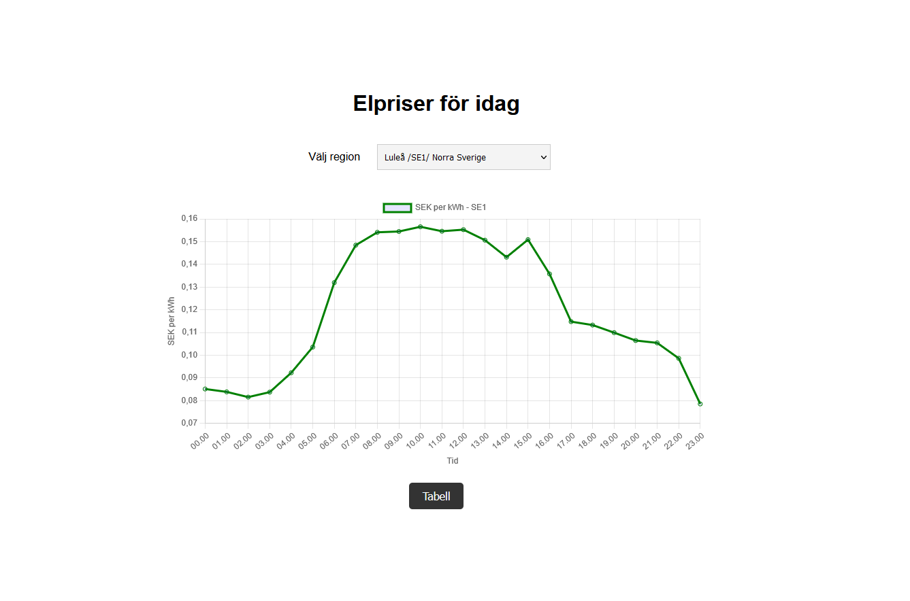

# L3 Electricity Price-App

## Project description
Welcome to the electricity price application, an app that helps you view electricity prices for different regions in Sweden. Using cutting-edge technologies such as JavaScript and Node.js, the application provides an intuitive and user-friendly interface for monitoring electricity prices. Whether you're a homeowner looking to save on energy costs, a business owner managing expenses, or just an enthusiast interested in staying informed, my app offers the tools you need.

**Key Features:**
- **Today's Prices:** Get up-to-date electricity prices for various regions.
- **30-Day History:** Explore historical prices to spot trends.
- **Advanced Calculations:** Calculate average, minimum, maximum, median, and standard deviation for today's prices.
- **Data Visualization:** View electricity prices in both graph and table formats for better insights.

It has been very fun to develope this webb-appliction and I hope you will enjoy it as much as I do.

## Prerequisites
- Konwledge in Visual Studio Code

## Installation
To install the application, you need to first clone the project from GitHub. You find the project on GitHub at https://github.com/nellyolofsson/L3.git, then you press the code button and copy the link. Or alternatively, you can download the project as a zip file and extract it to a folder.
Now you need to open a terminal and navigate to the folder where you want to clone the project. Then you type the following in the terminal:

```bash

git clone https://github.com/nellyolofsson/L3.git

```

Now that you have cloned the project, you can open it in Studio Visual Code. Open the project folder where you have cloned the project.

Now you need to run npm install to install all the necessary packages. You can do this by typing the following in the terminal:
```bash

npm install

```
Now you have everything installed, and you need to add a .env file, you can to that by adding a new file in the root folder that you name ".env" then you need to add the following content to the file:
```javascript

PORT=3000
BASE_URL="/"
SESSION_NAME="asfdgkdfgaerr"
SESSION_SECRET="gfdgdfgksfenffff"

```

Now you should be able to start the application by typing the following in the terminal:
```bash

npm run dev

```

Then, open the web browser and go to http://localhost:3000/ to view the application.

## Usage
Once you have started the application, you can view electricity prices for different regions in Sweden. You can see electricity prices for today, the last 30 days. It also calculates the prices in average, min, max, median and standard deviation. You can view electricity prices in both a graph and a table.

## Examples


## License

This project is licensed under the [ISC License](https://github.com/nellyolofsson/L2/blob/main/LICENSE.md) - see the [license file](https://github.com/nellyolofsson/L2/blob/main/LICENSE.md) for details.

## Status
This project is currently in active development.

Here's what you can do with the app right now:

- View electricity prices for today, including average, minimum, maximum, median, and standard deviation calculations.
- Analyze electricity prices for the last 30 days. 
- Enjoy color-coded visualization of prices in the last 30 days based on their value, making it easy to spot high and low prices.
- Be aware that a style issue in the table within the price today view is on my radar for fixing.

## Future Plans

I have exciting plans for the future of this project:

- Implement a feature that enables you to compare electricity prices across different regions in Sweden.
- Address the style issue in the table within the price view for a smoother user experience.
- Enhance data visualization by introducing color-coding in the graphs. Prices will be represented in different colors to signify whether they are high or low, similar to the feature already present in the last 30 days view.
- Expand the application's utility by providing practical use case examples. You'll soon be able to see the cost of running common appliances, such as taking a shower, charging a phone, or cooking a meal, giving you real-world insights into how electricity prices affect your daily life.

## Links to other documentation

- swedish-electricity-prices-region on npm: This module is the backbone of my electricity price application. It allows my to fetch and calculate electricity prices in Sweden, providing historical data and various metrics for analysis.

- Chart.js on npm: I utilize Chart.js to create interactive and visually appealing graphs to represent electricity price data. It's a versatile library for charting and graphing that complements my application's data visualization capabilities.
