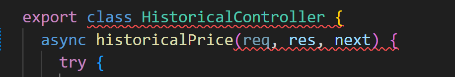

## Reflektion Clean code

# Kapitel 2 Meaningful Names
I kapitel 2 har jag reflekterat över av att använda meningsfulla namn i min kod. Jag har aktivt följt reglerna "Use Intention-revealing Names" och "Make Meaningful Distinctions" varje gång jag skapar nya klasser/funktioner i min applikation. Jag är nöjd med att min modulstruktur och klassnamnen/funktioner redan var bra och tydliga från början, vilket inte krävde några större ändringar.
```javascript
// "Use Intention-revealing Names" från min applikation
 async #fetchHistoricalDataArray () {
 }
```

# Kapitel 3 Functions
I kapitel 3 har jag stött på utmaningen att skapa funktioner som följer reglen "Do One Thing." Det har varit en utmaning, och jag har verkligen försökt att bryta ner mina funktioner till mindre, självständiga delar. Jag har lyckats med att skapa några små funktioner, som clearTable, som enbart har en specifik uppgift. Ett tydligt exempel är när jag tidigare hade kod som tableBody.innerHTML = '' inbäddad i en annan funktion, och jag insåg att jag ville ha den i en separat funktion eftersom den bara utför en uppgift.

```javascript
// "Do One Thing" från min appliaktion
function clearTable() {
    tableBody.innerHTML = ''
  }

```
I min modul har jag lyckats omstrukturera en metod för att minska antalet argument "Function Argments" den tar. Ursprungligen hade metoden 8 argument, vilket gjorde den komplex och svår att använda. Efter omstruktureringen tar nu metoden endast 2 argument, vilket har ökat dess tydlighet och användbarhet. 
```javascript
// "Function Argments" från min modul innan omstrukturering
 async compareHistoricalData(year1, month1, year2, month2, region1, region2, regionCode1, regionCode2) {
 }
// "Function Argments" från min modul efter omstrukturering
 async compareHistoricalData(region1Options, region2Options) {
}
```

# Kapitel 4 Comments
I kapitel 4 reflekterade jag över användningen av kommentarer i min applikation. Jag har helt struntat i användningen av kommentarer eftersom jag har insett vikten av att använda meningsfulla namn för funktioner och variabler. Reglen "Don't Use A Comment When You Can Use a Function or a Variable," som boken betonar, har blivit en central del av min kodning. Jag har aktivt strävat efter att extrahera funktioner och variabler för att göra min kod mer självdokumenterande och därmed minska behovet av kommentarer. Jag har även uppdaderat i min modul och den innehåller mindre kommentarer än tidigare.

Jag har dock upplevt en viss störning när jag använder ESLint, som flaggar för uteblivna kommentarer. 




# Kapitel 5 Formatting
I kapitel 5 har jag arbetat med att förbättra formateringen av min kod. Jag har lyckats följa reglerna  "Vertical Formatting" och "Horizontal Formatting" för att göra koden mer läsbar och lätt att följa. Jag har särskilt fokuserat på att hålla min kod väl strukturerad och organiserad.

Mitt huvudfokus har varit att använda små och väldefinierade klasser och funktioner för att undvika att ha stora och svåröverskådliga kodrader. Ett konkret exempel på detta är en ändring jag gjorde i min modul, där jag bröt ut en stor klass i två mindre klasser. Denna omstrukturering har resulterat i en mer läsbar kod som är enklare att följa och underhålla. 

Här är ett exempel på min controller från applikationen:
```javascript
export class HomeController {
  index (req, res, next) {
    res.render('home/index')
  }
}
```

# Kapitel 6 Objects and Data Structures
I kapitel 6 har jag reflekterat över "Data/Object Anti-Symmetry" och hur jag kan använda mig av det i min kod. Jag har försökt att undvika att skapa klasser som bara innehåller getter- och setter-metoder, och istället skapa klasser som innehåller metoder som utför specifika uppgifter. Jag har även försökt att undvika att skapa klasser som bara innehåller metoder utan några instansvariabler, och istället skapa klasser som innehåller både metoder och instansvariabler. 

Jag använder mig av objekt för att utföra specifika uppgifter på data och använder mig av datastrukturer för att hantera datalagring. Jag har försökt efterstäva detta även i min modul.
```javascript	

// Min modul som är en objektklass där använder jag metoden fetchHistoricalData för att hämta data
import { ElectricityPriceHistoricalView } from 'swedish-electricity-prices-region/src/index.js'

  async #fetchHistoricalDataInRange (startDate, endDate, view) {
    const historicalDataArray = []
    while (startDate <= endDate) {
      const historicalData = await view.fetchHistoricalData(startDate)
      historicalDataArray.push({ date: startDate, data: historicalData })
      startDate = this.#incrementDate(startDate)
    }
    return historicalDataArray
  }

// Datastrukturer för att lagra historiska data i historicalDataArray. 
  async #fetchHistoricalDataArray () {
    const electricityPriceTodayView = new ElectricityPriceHistoricalView()
    const startDate = this.#calculateStartDate()
    const endDate = this.#calculateEndDate()
    return this.#fetchHistoricalDataInRange(startDate, endDate, electricityPriceTodayView)
  }
```


# Kapitel 7 Error Handling
I kapitel 7 har jag insett att min kod saknar en robust felhanteringsstrategi. Jag har ofta använt grundläggande try-catch-block för att hantera fel, vilket inte alltid ger tillräcklig information om felets typ eller ursprung. Boken Clean Code rekommenderar att man skapar anpassade felhanteringsklasser för att bättre hantera olika typer av fel, såsom nätverksfel eller fel orsakade av ogiltiga användardata. "Define Exception Classes in Terms of a Caller's Needs"

Genom att använda anpassade felhanteringsklasser kan jag ge detaljerade felmeddelanden och använda specifika felklasser för olika situationer. Jag har inte hunnit uppdatera något av detta i min modul, använder mig fortfarande av grundläggande try-catch-block.
 ```javascript
// Exempel på hur jag hade kunnat skapa en egen felhanteringsklass?
class CustomError extends Error {
  constructor(message) {
    super(message)
    this.name = this.constructor.name
  }
}

// Användning
try {
  // Något som kan orsaka ett fel
  throw new CustomError('Detta är ett anpassat felmeddelande.')
} catch (error) {
  console.error(error.name, error.message);
}
```

# Kapitel 8 Boundaries
I kapitel 8 har jag noga övervägt användningen av externa bibliotek i min applikation. Jag känner att jag har använt externa bibliotek på ett genomtänkt sätt. Ett konkret exempel är hur jag har skapat en wrapper-klass runt en av mina externa beroenden, nämligen ElectricityPriceHistoricalView. Syftet med denna wrapper är att agera som ett skyddsskikt om det externa API:et jag använder någon gång i framtiden skulle sluta fungera eller ändras. 

Det jag har gjort är att skapa ett gränssnitt, IElectricityPriceHistoricalView, som beskriver den förväntade funktionaliteten av ElectricityPriceHistoricalView. Genom att göra detta kan jag använda detta gränssnitt som en abstraktion när jag interagerar med ElectricityPriceHistoricalView.

```javascript
// Ett gränssnitt
import { ElectricityPriceHistoricalView } from 'swedish-electricity-prices-region/src/index.js'

const IElectricityPriceHistoricalView = {
  fetchHistoricalData: async function(date) {
    const electricityPriceHistoricalView = new ElectricityPriceHistoricalView()
    return electricityPriceHistoricalView.fetchHistoricalData(date)
  }
}
export default IElectricityPriceHistoricalView

// Jag har även skapat en wrapper-klass, ElectricityPriceHistoricalViewWrapper, som använder detta gränssnitt för att hämta data.
import IElectricityPriceHistoricalView from './IElectricityPriceHistoricalView.js'

export class ElectricityPriceHistoricalViewWrapper {
  constructor () {
    this.actualView = new IElectricityPriceHistoricalView()
  }

  async fetchHistoricalData (date) {
    return this.actualView.fetchHistoricalData(date)
  }
}

```

Detta följer "Clean Boundaries" i från boken genom att använda den här abstraktionen kan jag skapa en tydlig uppdelning mellan min kod och det externa beroendet, vilket gör det enklare att hantera och underhålla min kod om något skulle ändras i framtiden. Jag vill även tilläga att jag inte har någon aning om det jag gjort funkar...

# Kapitel 9 Unit Tests
I kaptiel 9 i boken handlar det om enhetstester, just nu har jag inga enhetstester i min applikation, vilket är något jag vill lägga till i framtiden. Jag anser inte att jag har tillräckligt med kunskap om enhetstester för att kunna skriva enhetstester därför har jag manuellt testat min kravspecifikation. Jag hade dock velat ha de i min modul för oj vad mycket snabbare det hade gått att testa mina metoder. Enligt bokens regler F.I.R.S.T. ska enhetstester vara snabba, oberoende, repeterbara, självvaliderande och tidiga. Enhetstester är bra men jag anser att i min applikation så är det inte nödvändigt att ha enhetstester för att den inte ska används av någon annan än mig själv. Jag förstår syftet med enhetstester och jag kommer att använda mig av det i framtiden när jag väl har lärt mig mer om det.


# Kapitel 10 Classes
I kapitel 10 har jag funderat över vikten av att ha små och väldefinierade klasser i min applikation "Classes Should Be Small!". Redan när jag utvecklade min modul insåg jag att skapa små och tydliga klasser är viktigt. 

Jag har även försökt följa "The Single Responsibility Principle" genom att skapa klasser som har ett tydligt ansvarsområde. Min controller har till exempel ett tydligt ansvarsområde, nämligen att hantera historisk data och använda en dataService för att hämta data och en viewHandler för att rendera den. 

Jag har även fokuserat på "Encapsulation" genom att använda privata metoder och jag har skapat två separata klasser för att hantera specifika uppgifter.

```javascript
// Exempel på en klass som har ett tydligt ansvarsområde
import { DataService } from './dataService.js'
import { ViewHandler } from './viewHandler.js'

export class HistoricalController {
  constructor() {
    this.dataService = new DataService()
    this.viewHandler = new ViewHandler()
  }

  async historicalPrice(req, res, next) {
    try {
      const historicalDataArray = await this.dataService.fetchHistoricalDataArray()
      this.viewHandler.renderElectricityData(res, { historicalDataArray })
    } catch (error) {
      this.#handleErrors(next, error)
    }
  }

  #handleErrors (next, error) {
    next(error)
  }
}
```

# Kapitel 11 Systems
I kapitel 11 har jag reflekterat över hur jag kan skapa en tydlig uppdelning mellan olika delar av min applikation. Jag har försökt att skapa en tydlig uppdelning mellan mina controllers/vyer. Jag kan refera till reglen "Dependency Inversion Principle" i boken som jag har försökt att följa.

För att minska beroenden har jag även tagit steget att skapa två nyttiga klasser: en "ViewHandler" och en "DataService". Dessa klasser hjälper till att skapa en tydlig uppdelning av ansvarsområdena i min applikation och minskar beroendet mellan olika delar av koden. I min modul har jag flera klasser som har ett tydligt ansvarsområde men som är mer beroende av varandra. 

Detta har varit en intressant utmnaing för mig, och jag är nöjd över hur jag löste de med hjälp av Clean Code samt din vägledning som lärare. Jag hoppas att mina beslut och implementeringar är korrekta  och att jag har förstått reglerna rätt.

```javascript
// Min viewHandler som hanterar mina vyer
export class ViewHandler {
  renderElectrityToday(res, data) {
    res.render('electricity/today', data)
  }

  renderElectricityData(res, data) {
    res.render('electricity/historical', data)
  }
}

// Som sedan används i min controller samma med dataService
import { DataService } from './dataService.js'
import { ViewHandler } from './viewHandler.js'

export class TodayController {
  constructor() {
    this.dataService = new DataService()
    this.viewHandler = new ViewHandler()
  }

  async todayPrice (req, res, next) {
    try {
      const electricityPriceToday = await this.dataService.fetchElectricityPriceToday()
      const hourData = await this.dataService.fetchHourData()
      this.viewHandler.renderElectrityToday(res, { electricityPriceToday, hourData })
    } catch (error) {
      this.#handleErrors(next, error)
    }
  }
}
```


